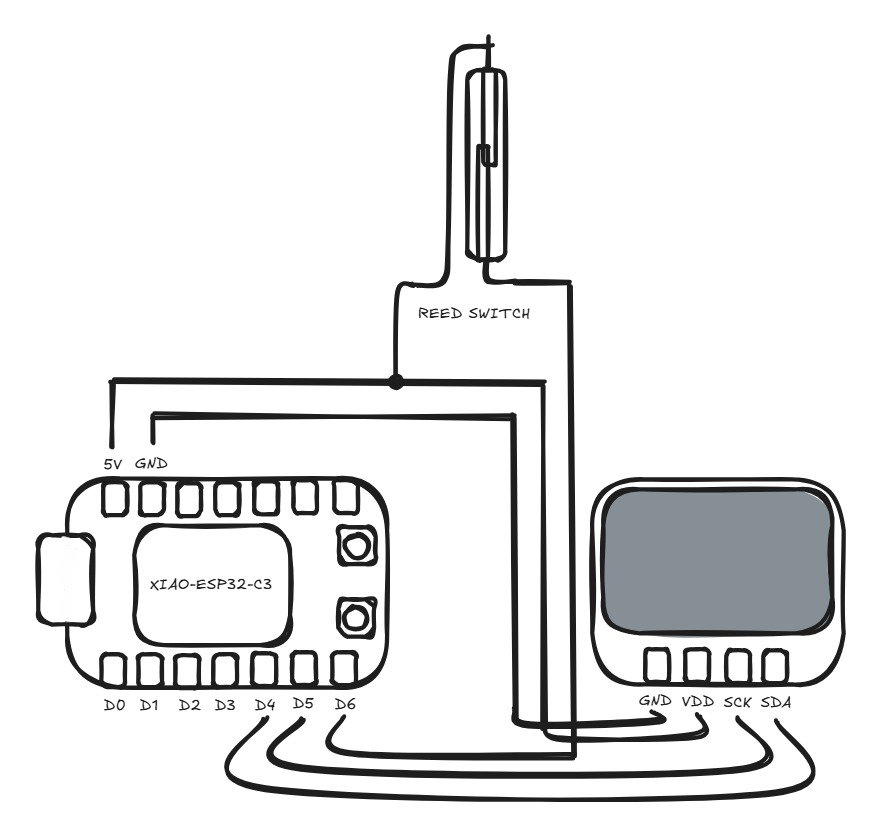
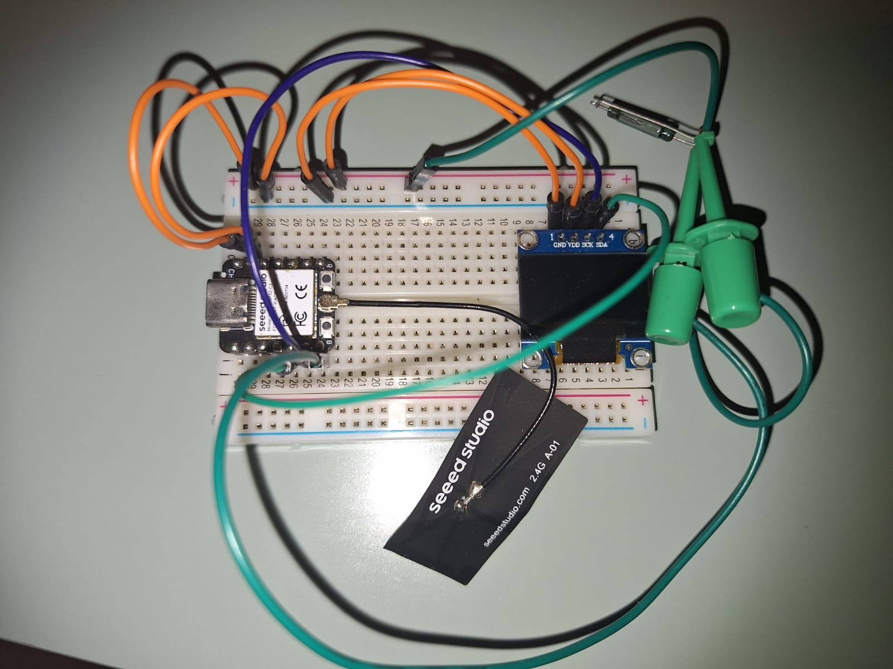

# digital-bike-speedometer
Simple digital speedometer for bikes made with an *ESP32*, a *Display* and a *Reed Switch*.

# The Prototype

# How it works
The reed switch connects an input(pulldown) pin to the VCC when a magnetic field gets in its range. By putting a magnet on the wheel of a bike, it is possible to detect every time the wheel completes a full rotation. To avoid problems with bouncing, the max speed can be defined on the code, the debounce delay is set to the time between a full wheel rotation considering the set max speed. It is also important to point out other parameters such as the wheel radius, which need to be set according to your bicycle for the speed calculation.

# Assembled Circuit

